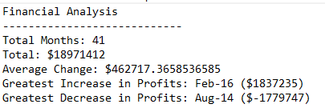
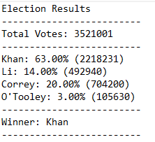

# python-challenge

This project involves creating python scripts for two different datasets.

## PyBank

Using a set of financial data [budget_data.csv](PyBank/budget_data.csv), this Python script analyzes records to calculate the following:

  * The total number of months included in the dataset

  * The total net amount of "Profit/Losses" over the entire period

  * The average change in "Profit/Losses" between months over the entire period

  * The greatest increase in profits (date and amount) over the entire period

  * The greatest decrease in losses (date and amount) over the entire period

The final script prints the result of the analysis to the terminal and exports a text file with the results.

## PyPoll

This Python script counts poll data from [election_data.csv](PyPoll/election_data.csv). The dataset is composed of three columns: `Voter ID`, `County`, and `Candidate`. The script analyzes the votes and calculates each of the following:

  * The total number of votes cast

  * A complete list of candidates who received votes

  * The percentage of votes each candidate won

  * The total number of votes each candidate won

  * The winner of the election based on popular vote.

As with the first script, prints the results to terminal and exports a text file with the results. 

