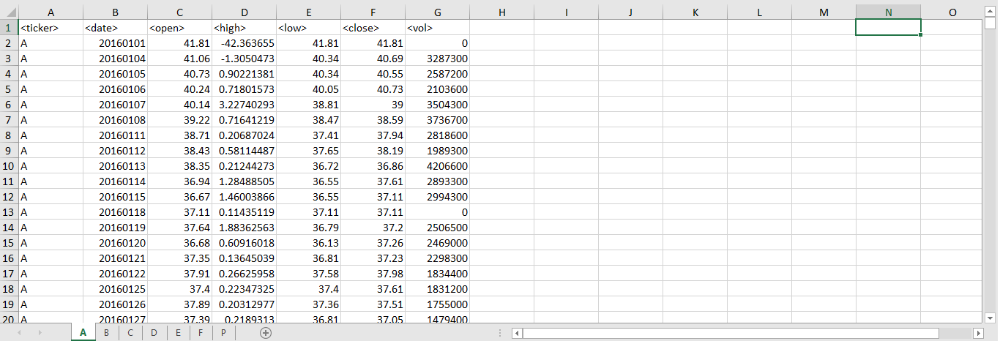
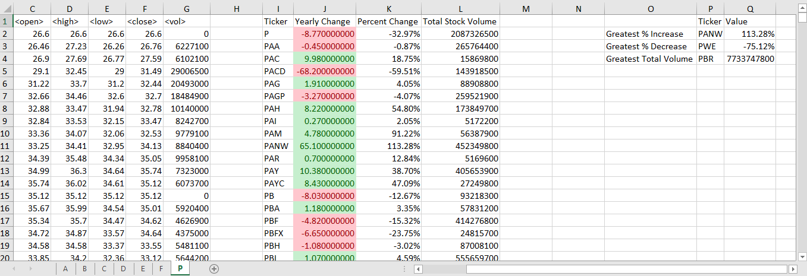

# VBA Analysis of Wall Street

For this project, a VBA script is used to create an analysis of a test sample of Stock Market data. The dataset contains information for each day a stock is in the market (see below). 

The script creates a table showing the ticker symbol, yearly change, percent change over the year, and total amount of volume each stock had over the year. Certain care had to be used when creating the script so as to correctly declare the first and last date for each tracker.

The script also applies a conditional format to highlight positive changes in green and negative changes in red.

It also creates another table to identify the stocks with the "Greatest % increase", "Greatest % Decrease" and "Greatest total volume". The code then loops the whole process with each tab of data in the spreadsheet.

Result of the macro ran on the test data results in the following: 

Macro uploaded as .VBS